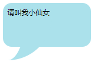
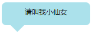
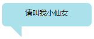
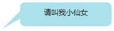
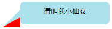
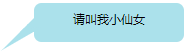
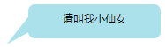
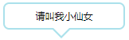

在实际工作中，有时候为了项目中页面的美观性，会需要把文字放到类似对话框的元素中，上一篇博客介绍了用CSS画各种图形，那这一篇我们就来了解一下怎样用CSS来画对话框或对话气泡吧
## 小尾巴
在正文开始之前，我们首先来看一下在下面用到的对话框的小尾巴是怎么画出来的
```html
.tail-ltop {
    width: 100px;
    height: 100px;
    border-top: 30px solid #abe1eb;
    -moz-border-radius: 100px 0 0 0;
    -webkit-border-radius: 100px 0 0 0;
    border-radius: 100px 0 0 0;
}
```

其实这个小尾巴是由下面这个图形，经过调整圆角度和边框宽度得到的

从上面的代码里改变边框宽度及圆角弧度即可得到多个方向的小尾巴，而且还可以给它应用`transform：rotate()`还可以得到各个方向的小尾巴图形，再结合矩形，就可以组成对话框啦
```html
.tail-rtop {
    width: 100px;
    height: 100px;
    border-top: 30px solid #abe1eb;
    -moz-border-radius: 0 100px 0 0;
    -webkit-border-radius: 0 100px 0 0;
    border-radius: 0 100px 0 0;
}
```

```html
.tail-rtop {
    width: 100px;
    height: 100px;
    border-right: 30px solid #abe1eb;
    -moz-border-radius: 0 100px 0 0;
    -webkit-border-radius: 0 100px 0 0;
    border-radius: 0 100px 0 0;
}
```

```html
.tail-rbottom {
    width: 100px;
    height: 100px;
    border-right: 30px solid #abe1eb;
    -moz-border-radius: 0 0 100px 0;
    -webkit-border-radius: 0 0 100px 0;
    border-radius: 0 0 100px 0;
}
```

```html
.tail-rbottom {
    width: 100px;
    height: 100px;
    border-bottom: 30px solid #abe1eb;
    -moz-border-radius: 0 0 100px 0;
    -webkit-border-radius: 0 0 100px 0;
    border-radius: 0 0 100px 0;
}
```

```html
.tail-lbottom {
    width: 100px;
    height: 100px;
    border-bottom: 30px solid #abe1eb;
    -moz-border-radius: 0 0 0 100px;
    -webkit-border-radius: 0 0 0 100px;
    border-radius: 0 0 0 100px;
}
```

```html
.tail-lbottom {
    width: 100px;
    height: 100px;
    border-left: 30px solid #abe1eb;
    -moz-border-radius: 0 0 0 100px;
    -webkit-border-radius: 0 0 0 100px;
    border-radius: 0 0 0 100px;
}
```

```html
.tail-ltop {
    width: 100px;
    height: 100px;
    border-left: 30px solid #abe1eb;
    -moz-border-radius: 100px 0 0 0;
    -webkit-border-radius: 100px 0 0 0;
    border-radius: 100px 0 0 0;
}
```

## 小尾巴对话框
### 圆角矩形
```html
.roundrect-tail {
    width: 180px;
    background: #abe1eb;
    -moz-border-radius: 20px;
    -webkit-border-radius: 20px;
    border-radius: 20px;
    position: relative;
    padding: 15px;
}
.roundrect-tail::after {
    content: '';
    width: 100px;
    height: 100px;
    position: absolute;
    bottom: -35px;
    left: -50px;
    border-right: 60px solid #abe1eb;
    -moz-border-radius: 0 0 100px 0;
    -webkit-border-radius: 0 0 100px 0;
    border-radius: 0 0 100px 0;
    z-index: -1;
}
```

根据实际情况，自行调整小尾巴的朝向，上面也已经列出各个方向的小尾巴，如果还不能满足可借用`transform：rotate()`进行调整，这里就不再多说了
注：这里定位用的是`bottom`而不是`top`为什么？`top`是根据相对定位的顶点进行定位，而`bottom`是根据相对定位的底端进行定位，这里因为对话框没有给高度，就是根据内容自适应，所以顶点不会改变，但是当内容过多撑起对话框时，底端就会改变，而我们要求小尾巴是根据元素的高度改变而调整上下位置的，所以这里用`bottom`而不用`top`。下面的例子中也一样
### 椭圆
```html
.oval-tail {
    width: 180px;
    background: #abe1eb;
    -moz-border-radius: 50%;
    -webkit-border-radius: 50%;
    border-radius: 50%;
    position: relative;
    padding: 25px 30px;
    text-align: center;
}
.oval-tail::before {
    content: '';
    width: 100px;
    height: 100px;
    position: absolute;
    bottom: -30px;
    left: -50px;
    border-right: 60px solid #abe1eb;
    -moz-border-radius: 0 0 100px 0;
    -webkit-border-radius: 0 0 100px 0;
    border-radius: 0 0 100px 0;
    z-index: -1;
}
```

其实就是上面那个例子，把矩形变成椭圆即可，是不是很简单

## 三角形+对话框
### 等腰直角三角形
```html
.roundrect-triangle1{
    width: 180px;
    background: #abe1eb;
    -moz-border-radius: 10px;
    -webkit-border-radius: 10px;
    border-radius: 10px; 
    position: relative;
    padding: 10px;
    text-align: center;
}
.roundrect-triangle1::before {
    content:'';
    width: 0;
    height: 0;
    position: absolute;
    bottom: -30px;
    left: 20px;
    border: 15px solid #abe1eb;
    border-color: #abe1eb transparent transparent;
}
```

当然有了这个例子和上一篇博客，要改变这个三角形的朝向是轻而易举的
### 直角三角形
```html
.roundrect-triangle2{
    width: 180px;
    background: #abe1eb;
    -moz-border-radius: 10px;
    -webkit-border-radius: 10px;
    border-radius: 10px; 
    position: relative;
    padding: 10px;
    text-align: center;
}
.roundrect-triangle2::before {
    content:'';
    width: 0;
    height: 0;
    position: absolute;
    bottom: -24px;
    left: 20px;
    border-width: 12px 12px;
    border-style: solid;
    border-color: #abe1eb #abe1eb transparent transparent;
}
```

根据上面两个例子，我们发现可以通过调整`border`的`border-width`和`border-color`来改变三角形的形状和方向，从而改变整个对话框的样式
### 钝角三角形
```html
.roundrect-triangle3{
    width: 180px;
    height: 32px;
    background: #abe1eb;
    -moz-border-radius: 10px;
    -webkit-border-radius: 10px;
    border-radius: 10px; 
    position: relative;
    padding: 10px;
    text-align: center;
}
.roundrect-triangle3::before {
    content:'';
    width: 0;
    height: 0;
    position: absolute;
    top: 19px;
    left: -40px; 
    border-width:20px;
    border-style:solid;
    border-color: transparent #abe1eb #abe1eb transparent;
}
.roundrect-triangle3::after{            
    content:'';
    width: 0;
    height: 0;
    position: absolute;
    top: 36px;
    left: -40px;             
    border-width:10px 20px 12px 20px;
    border-style:dashed solid solid dashed;
    border-color:transparent #fff #fff transparent;
}
```

这是我看到的很多博客做这种效果都是画一大一小两个直角三角形，并且用小直角三角形遮住大的直角三角形（见下图），当让红色部分变成背景色时，就实现上面的效果了

但这样做有一个弊端，就是当背景不是纯色（比如：渐变色或使用图片为背景）时，就无法实现此效果了，而且实际应用中，像这种对话框往往就是用在非纯色背景的情况下的，所以我想到了是否可以延续上面的用两个三角组成这个图形，但是不是用遮盖，而是用旋转方法，也就是用一个有边框生成的直角三角形和一个底边框生成的钝角三角形旋转一定度数组成果然实现了，代码如下
```html
.roundrect-triangle3{
    width: 180px;
    height: 32px;
    background: #abe1eb;
    -moz-border-radius: 10px;
    -webkit-border-radius: 10px;
    border-radius: 10px; 
    position: relative;
    padding: 10px;
    text-align: center;
}
.roundrect-triangle3::before {
    content:'';
    width: 0;
    height: 0;
    position: absolute;
    top: 19px;
    left: -19px;
    border-width:10px;
    border-style:solid;
    border-color:transparent #abe1eb #abe1eb transparent;
}
.roundrect-triangle3::after{
    content:'';
    width: 0;
    height: 0;
    position: absolute;
    top: 29px;
    left: -52px;            
    border-width: 10px 20px 10px 40px;
    border-style: solid;
    border-color:transparent transparent #abe1eb transparent; 
    -webkit-transform: rotate(-30deg);
    -moz-transform: rotate(-30deg);
    -o-transform: rotate(-30deg);
    -ms-transform: rotate(-30deg);
    transform: rotate(-30deg);
}
```

写上面那段代码的时候，我发现为什么我要用两个三角形拼合起来呢，直接用像上面那样用底边框实现一个钝角三角形，然后旋转一定度数不一样可以实现，而且相较于上面还更简单，唯一不同的是底边框变为上边框而已，这样旋转的角度会小一些，当然，你如果执意喜欢用底边框来变换，也是可以的

```html
.roundrect-triangle3{
    width: 180px;
    height: 32px;
    background: #abe1eb;
    -moz-border-radius: 10px;
    -webkit-border-radius: 10px;
    border-radius: 10px; 
    position: relative;
    padding: 10px;
    text-align: center;
}
.roundrect-triangle3::before {
    content:'';
    width: 0;
    height: 0;
    position: absolute;
    top: 34px;
    left: -34px;            
    border-width: 15px 20px 10px 35px;
    border-style: solid;
    border-color: #abe1eb transparent transparent transparent;
    transform: rotate(-52deg);
}
```

## 无背景色对话框
```html
.roundrect-triangle4 {
    width: 180px;
    border: 2px solid #abe1eb;
    -moz-border-radius: 10px;
    -webkit-border-radius: 10px;
    border-radius: 10px;
    position: relative;
    padding: 10px;
    text-align: center;
}
.roundrect-triangle4::before {
    content: '';
    width: 0;
    height: 0;
    position: absolute;
    left:80px;
    bottom:-32px;
    border-width:15px;
    border-style:solid;
    border-color:#abe1eb transparent transparent;
}
.roundrect-triangle4::after{
    content: '';
    width: 0;
    height: 0;
    position: absolute;
    left:80px;
    bottom:-28px;
    border-width:15px;
    border-style:solid dashed dashed;
    border-color:#ffffff transparent transparent;
}
```

注：这里所说的无背景，其实是指背景和边框颜色不一样，本例中，背景为白色，`.roundrect-triangle4::before`为元素边框色的三角形`.roundrect-triangle4::after`为元素背景色的三角形，用第二个遮住第一个大部分，只留下下面那个三角轮廓，就实现了上图中的效果了