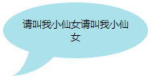

在实际工作中，有时候为了项目中页面的美观性，会需要把文字放到类似对话框的元素中，上一篇博客介绍了用CSS画各种图形，那这一篇我们就来了解一下怎样用CSS来画对话框或对话气泡吧
## 小尾巴
在正文开始之前，我们首先来看一下在下面用到的对话框的小尾巴是怎么画出来的
```html
.tail-ltop {
    width: 100px;
    height: 100px;
    border-top: 30px solid #abe1eb;
    -moz-border-radius: 100px 0 0 0;
    -webkit-border-radius: 100px 0 0 0;
    border-radius: 100px 0 0 0;
}
```

其实这个小尾巴是由下面这个图形，经过调整圆角度和边框宽度得到的

从上面的代码里改变边框宽度及圆角弧度即可得到多个方向的小尾巴，而且还可以给它应用`transform：rotate()`还可以得到各个方向的小尾巴图形，再结合矩形，就可以组成对话框啦
```html
.tail-rtop {
    width: 100px;
    height: 100px;
    border-top: 30px solid #abe1eb;
    -moz-border-radius: 0 100px 0 0;
    -webkit-border-radius: 0 100px 0 0;
    border-radius: 0 100px 0 0;
}
```

```html
.tail-rtop {
    width: 100px;
    height: 100px;
    border-right: 30px solid #abe1eb;
    -moz-border-radius: 0 100px 0 0;
    -webkit-border-radius: 0 100px 0 0;
    border-radius: 0 100px 0 0;
}
```

```html
.tail-rbottom {
    width: 100px;
    height: 100px;
    border-right: 30px solid #abe1eb;
    -moz-border-radius: 0 0 100px 0;
    -webkit-border-radius: 0 0 100px 0;
    border-radius: 0 0 100px 0;
}
```

```html
.tail-rbottom {
    width: 100px;
    height: 100px;
    border-bottom: 30px solid #abe1eb;
    -moz-border-radius: 0 0 100px 0;
    -webkit-border-radius: 0 0 100px 0;
    border-radius: 0 0 100px 0;
}
```

```html
.tail-lbottom {
    width: 100px;
    height: 100px;
    border-bottom: 30px solid #abe1eb;
    -moz-border-radius: 0 0 0 100px;
    -webkit-border-radius: 0 0 0 100px;
    border-radius: 0 0 0 100px;
}
```

```html
.tail-lbottom {
    width: 100px;
    height: 100px;
    border-left: 30px solid #abe1eb;
    -moz-border-radius: 0 0 0 100px;
    -webkit-border-radius: 0 0 0 100px;
    border-radius: 0 0 0 100px;
}
```

```html
.tail-ltop {
    width: 100px;
    height: 100px;
    border-left: 30px solid #abe1eb;
    -moz-border-radius: 100px 0 0 0;
    -webkit-border-radius: 100px 0 0 0;
    border-radius: 100px 0 0 0;
}
```

## 小尾巴对话框
### 圆角矩形
```html
.roundrect-tail{
    width: 180px;
    height: 80px;
    background: #abe1eb;
    -moz-border-radius: 20px;
    -webkit-border-radius: 20px;
    border-radius: 20px; 
    position: relative;
    padding: 10px;
}
.roundrect-tail::after {
    content:'';
    width: 100px;
    height: 100px;
    position: absolute;
    top: 30px;
    left: -50px;
    border-right: 60px solid #abe1eb;
    -moz-border-radius: 0 0 100px 0;
    -webkit-border-radius: 0 0 100px 0;
    border-radius: 0 0 100px 0;
}
```

根据实际情况，自行调整小尾巴的朝向，上面也已经列出各个方向的小尾巴，如果还不能满足可借用`transform：rotate()`进行调整，这里就不再多说了
### 椭圆
```html
.oval-tail{
    width: 180px;
    height: 80px;
    background: #abe1eb;
    -moz-border-radius: 20px;
    -webkit-border-radius: 20px;
    border-radius: 50%; 
    position: relative;
    padding: 10px;
    text-align: center;
}
.oval::before {
    content:'';
    width: 100px;
    height: 100px;
    position: absolute;
    top: 30px;
    left: -50px;
    border-right: 60px solid #abe1eb;
    -moz-border-radius: 0 0 100px 0;
    -webkit-border-radius: 0 0 100px 0;
    border-radius: 0 0 100px 0;
}
```

其实就是上面那个例子，把矩形变成椭圆即可，是不是很简单

