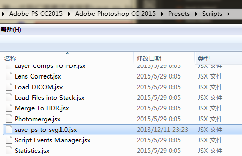

## 安装脚本
下载save-ps-to-svg1.0.jsx脚本，并放到PS的安装目录/Presets/Scripts文件夹下，如图所示

## 绘制svg图形
打开PS，使用形状工具绘图，（注：只有形状图层才可以保存为svg格式），并给该图层命名为xx.svg
## 保存为svg
先保存psd格式文件，然后点击文件->脚本->Save as svg，即可在该psd同目录的文件夹下发现.svg格式的文件