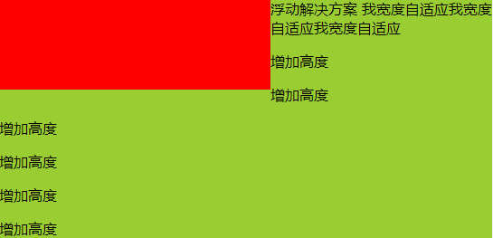

## 1 左固定，右自适应

### 1.1 浮动解决方案

```html
    <style>
        html,body{
            margin: 0;
            padding:0;
        }
        div{
            min-height: 100px;
        }
        .left {
            float: left;
            width: 300px;
            background: red;
        }
        .right {
             margin-left: 300px;
             background: yellowgreen;
        }
    </style>
    
    <div class="wrap">
        <div class="left"></div>
        <div class="right">浮动解决方案 我宽度自适应我宽度自适应我宽度自适应
            <p>增加高度</p>
            <p>增加高度</p>
            <p>增加高度</p>
            <p>增加高度</p>
            <p>增加高度</p>
            <p>增加高度</p>
        </div>
    </div>
```

注：上面.right 的 margin-left 属性可以用 overflow:hidden 来替代（让.right 开启 BFC）否则当右侧高度过大时，会出现如下效果：


特点：两栏高度不一致
优点：兼容性好
缺点：浮动元素过多会导致页面结构复杂，并且要清除浮动，否则会导致页面混乱

### 1.2 定位解决方案

#### 1.2.1 定位解决方案 1

```html
    <style>
        html,body{
            margin: 0;
            padding:0;
        }
        div{
            min-height: 100px;
        }
        .wrap{
            position: relative;
        }
        .left {
            position: absolute;
            width: 300px;
            background: red;
        }
        .right {
             margin-left: 300px;
             background: yellowgreen;
        }
    </style>
    
    <div class="wrap">
        <div class="left"></div>
        <div class="right">定位解决方案1 我宽度自适应我宽度自适应我宽度自适应
            <p>增加高度</p>
            <p>增加高度</p>
            <p>增加高度</p>
            <p>增加高度</p>
            <p>增加高度</p>
            <p>增加高度</p>
        </div>
    </div>
```

#### 1.2.2 定位解决方案 2

```html
    <style>
        html,
        body {
            margin: 0;
            padding: 0;
        }

        div {
            min-height: 100px;
        }

        .wrap {
            position: relative;
        }

        .left {
            position: absolute;
            width: 300px;
            background: red;
        }

        .right {
            position: absolute;
            left: 300px;
            right: 0;
            background: yellowgreen;
        }
    </style>
    
    <div class="wrap">
        <div class="left"></div>
        <div class="right">定位解决方案2 我宽度自适应我宽度自适应我宽度自适应
            <p>增加高度</p>
            <p>增加高度</p>
            <p>增加高度</p>
            <p>增加高度</p>
            <p>增加高度</p>
            <p>增加高度</p>
        </div>
    </div>
```

特点：两栏高度不一致
优点：兼容性好
缺点：脱离文档流，增加页面结构的复杂程度

### 1.3 table 解决方案

```html
    <style>
        html,
        body {
            margin: 0;
            padding: 0;
        }

        div {
            min-height: 100px;
        }

        .wrap {
            display: table;
            width: 100%;
        }

        .left {
            display: table-cell;
            width: 300px;
            background: red;
        }

        .right {
            display: table-cell;
            background: yellowgreen;
        }
    </style>

    <div class="wrap">
        <div class="left"></div>
        <div class="right">table解决方案 我宽度自适应我宽度自适应我宽度自适应
            <p>增加高度</p>
            <p>增加高度</p>
            <p>增加高度</p>
            <p>增加高度</p>
            <p>增加高度</p>
            <p>增加高度</p>
        </div>
    </div>
```

特点：两栏高度一致

### 1.4 flex 解决方案

```html
    <style>
        html,
        body {
            margin: 0;
            padding: 0;
        }

        div {
            min-height: 100px;
        }

        .wrap {
            display: flex;
        }

        .left {
            width: 300px;
            background: red;
        }

        .right {
            flex: 1;
            background: yellowgreen;
        }
    </style>

    <div class="wrap">
        <div class="left"></div>
        <div class="right">flex解决方案 我宽度自适应我宽度自适应我宽度自适应
            <p>增加高度</p>
            <p>增加高度</p>
            <p>增加高度</p>
            <p>增加高度</p>
            <p>增加高度</p>
            <p>增加高度</p>
        </div>
    </div>
```

特点：两栏高度一致
优点：CSS3 新属性，实现简单
缺点：兼容性差

### 1.5 grid 解决方案

```html
    <style>
        html,
        body {
            margin: 0;
            padding: 0;
        }

        div {
            min-height: 100px;
        }

        .wrap {
            display: grid;
            grid-template-columns: 300px auto;
        }

        .left {
            background: red;
        }

        .right {
            background: yellowgreen;
        }
    </style>

    <div class="wrap">
        <div class="left"></div>
        <div class="right">grid解决方案 我宽度自适应我宽度自适应我宽度自适应
            <p>增加高度</p>
            <p>增加高度</p>
            <p>增加高度</p>
            <p>增加高度</p>
            <p>增加高度</p>
            <p>增加高度</p>
        </div>
    </div>
```
特点：两栏高度一致
优点：CSS3新属性，实现简单
缺点：兼容性差

## 2 右固定，左自适应

### 2.1 浮动解决方案

```html
<style>
		html,body {
			margin: 0;
			padding: 0;
		}
		div {
			min-height: 100px;
        }        
		.left {
			background: yellowgreen;
			margin-right: 300px;
		}
		.right {
			float: right;
			width: 300px;
			background: red;
		}
	</style>

    <div class="wrap">
		<div class="left">浮动解决方案 我宽度自适应我宽度自适应我宽度自适应
			<p>增加高度</p>
			<p>增加高度</p>
			<p>增加高度</p>
			<p>增加高度</p>
			<p>增加高度</p>
			<p>增加高度</p>
		</div>
	</div>
	<div class="right"></div>
```
注：上面.right 的 margin-right 属性可以用 overflow:hidden 来替代（让.left 开启 BFC）
    在页面结构上，必须让固定的元素位于自适应的元素之前，否则若自适应的元素在前，因为其为块级元素，盒模型将会占一整行的宽度，这样固定的元素就会被挤到下面，页面结构就会混乱，如下图；而固定的元素在前，因为其设置了浮动，所以脱离了文档流，且z-index级别比文档流高，所以会压在自适应的元素之上

特点：两栏高度不一致
优点：兼容性好
缺点：浮动元素过多会导致页面结构复杂，并且要清除浮动，否则会导致页面混乱
### 2.2 定位解决方案
