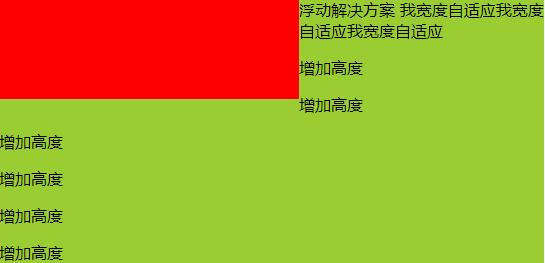
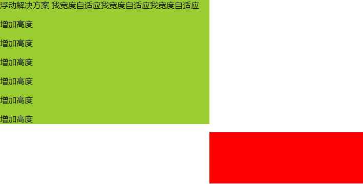

## 1 左固定，右自适应

### 1.1 浮动解决方案

```html
<style>
    html,body{
        margin: 0;
        padding:0;
    }
    div{
        min-height: 100px;
    }
    .left {
        float: left;
        width: 300px;
        background: red;
    }
    .right {
            margin-left: 300px;
            background: yellowgreen;
    }
</style>

<div class="wrap">
    <div class="left"></div>
    <div class="right">浮动解决方案 我宽度自适应我宽度自适应我宽度自适应
        <p>增加高度</p>
        <p>增加高度</p>
        <p>增加高度</p>
        <p>增加高度</p>
        <p>增加高度</p>
        <p>增加高度</p>
    </div>
</div>
```

注：上面.right 的 margin-left 属性可以用 overflow:hidden 来替代（让.right 开启 BFC）否则当右侧高度过大时，会出现如下效果：


特点：两栏高度不一致
优点：兼容性好
缺点：浮动元素过多会导致页面结构复杂，并且要清除浮动，否则会导致页面混乱

### 1.2 定位解决方案

#### 1.2.1 定位解决方案 1

```html
<style>
    html,body{
        margin: 0;
        padding:0;
    }
    div{
        min-height: 100px;
    }
    .wrap{
        position: relative;
    }
    .left {
        position: absolute;
        width: 300px;
        background: red;
    }
    .right {
            margin-left: 300px;
            background: yellowgreen;
    }
</style>

<div class="wrap">
    <div class="left"></div>
    <div class="right">定位解决方案1 我宽度自适应我宽度自适应我宽度自适应
        <p>增加高度</p>
        <p>增加高度</p>
        <p>增加高度</p>
        <p>增加高度</p>
        <p>增加高度</p>
        <p>增加高度</p>
    </div>
</div>
```

#### 1.2.2 定位解决方案 2

```html
<style>
    html,
    body {
        margin: 0;
        padding: 0;
    }

    div {
        min-height: 100px;
    }

    .wrap {
        position: relative;
    }

    .left {
        position: absolute;
        width: 300px;
        background: red;
    }

    .right {
        position: absolute;
        left: 300px;
        right: 0;
        background: yellowgreen;
    }
</style>

<div class="wrap">
    <div class="left"></div>
    <div class="right">定位解决方案2 我宽度自适应我宽度自适应我宽度自适应
        <p>增加高度</p>
        <p>增加高度</p>
        <p>增加高度</p>
        <p>增加高度</p>
        <p>增加高度</p>
        <p>增加高度</p>
    </div>
</div>
```

特点：两栏高度不一致
优点：兼容性好
缺点：脱离文档流，增加页面结构的复杂程度

### 1.3 table 解决方案

```html
<style>
    html,
    body {
        margin: 0;
        padding: 0;
    }

    div {
        min-height: 100px;
    }

    .wrap {
        display: table;
        width: 100%;
    }

    .left {
        display: table-cell;
        width: 300px;
        background: red;
    }

    .right {
        display: table-cell;
        background: yellowgreen;
    }
</style>

<div class="wrap">
    <div class="left"></div>
    <div class="right">table解决方案 我宽度自适应我宽度自适应我宽度自适应
        <p>增加高度</p>
        <p>增加高度</p>
        <p>增加高度</p>
        <p>增加高度</p>
        <p>增加高度</p>
        <p>增加高度</p>
    </div>
</div>
```

特点：两栏高度一致

### 1.4 flex 解决方案

```html
<style>
    html,
    body {
        margin: 0;
        padding: 0;
    }

    div {
        min-height: 100px;
    }

    .wrap {
        display: flex;
    }

    .left {
        width: 300px;
        background: red;
    }

    .right {
        flex: 1;
        background: yellowgreen;
    }
</style>

<div class="wrap">
    <div class="left"></div>
    <div class="right">flex解决方案 我宽度自适应我宽度自适应我宽度自适应
        <p>增加高度</p>
        <p>增加高度</p>
        <p>增加高度</p>
        <p>增加高度</p>
        <p>增加高度</p>
        <p>增加高度</p>
    </div>
</div>
```

特点：两栏高度一致
优点：CSS3 新属性，实现简单
缺点：兼容性差

### 1.5 grid 解决方案

```html
<style>
    html,
    body {
        margin: 0;
        padding: 0;
    }

    div {
        min-height: 100px;
    }

    .wrap {
        display: grid;
        grid-template-columns: 300px auto;
    }

    .left {
        background: red;
    }

    .right {
        background: yellowgreen;
    }
</style>

<div class="wrap">
    <div class="left"></div>
    <div class="right">grid解决方案 我宽度自适应我宽度自适应我宽度自适应
        <p>增加高度</p>
        <p>增加高度</p>
        <p>增加高度</p>
        <p>增加高度</p>
        <p>增加高度</p>
        <p>增加高度</p>
    </div>
</div>
```
特点：两栏高度一致
优点：CSS3新属性，实现简单
缺点：兼容性差
## 2 右固定，左自适应

### 2.1 浮动解决方案

```html
<style>
    html,body {
        margin: 0;
        padding: 0;
    }
    div {
        min-height: 100px;
    }        
    .left {
        background: yellowgreen;
        margin-right: 300px;
    }
    .right {
        float: right;
        width: 300px;
        background: red;
    }
</style>

<div class="wrap">
    <div class="left">浮动解决方案 我宽度自适应我宽度自适应我宽度自适应
        <p>增加高度</p>
        <p>增加高度</p>
        <p>增加高度</p>
        <p>增加高度</p>
        <p>增加高度</p>
        <p>增加高度</p>
    </div>
</div>
<div class="right"></div>
```
注：上面.left 的 margin-right 属性可以用 overflow:hidden 来替代（让.left 开启 BFC）
    在页面结构上，必须让固定的元素位于自适应的元素之前，否则若自适应的元素在前，因为其为块级元素，盒模型将会占一整行的宽度，这样固定的元素就会被挤到下面，页面结构就会混乱，如下图；而固定的元素在前，因为其设置了浮动，所以脱离了文档流，且z-index级别比文档流高，所以会压在自适应的元素之上

特点：两栏高度不一致
优点：兼容性好
缺点：浮动元素过多会导致页面结构复杂，并且要清除浮动，否则会导致页面混乱
### 2.2 定位解决方案
#### 2.2.1 定位解决方案 1
```html
<style>
    html,body {
        margin: 0;
        padding: 0;
    }
    div {
        min-height: 100px;
    }
    .wrap {
        position: relative;
    }
    .left {
        margin-right: 300px;
        background: yellowgreen;
    }
    .right {
        position: absolute;
        right: 0;
        top:0;
        width: 300px;
        background: red;
    }
</style>

<div class="wrap">
    <div class="right"></div>
    <div class="left">定位解决方案1 我宽度自适应我宽度自适应我宽度自适应
        <p>增加高度</p>
        <p>增加高度</p>
        <p>增加高度</p>
        <p>增加高度</p>
        <p>增加高度</p>
        <p>增加高度</p>
    </div>
</div>
```
注：定位解决方案1中，在页面结构上，固定的右侧栏也必须在自适应的左侧栏之前，理由同上，其左侧栏.left同样没有脱离文档流
#### 2.2.2 定位解决方案 2
```html
<style>
    html,body {
        margin: 0;
        padding: 0;
    }
    div {
        min-height: 100px;
    }
    .wrap {
        position: relative;
    }
    .left {
        position: absolute;
        left: 0;
        right: 300px;;
        background: yellowgreen;
    }
    .right {
        position: absolute;
        right: 0;
        width: 300px;
        background: red;
    }
</style>

<div class="wrap">
    <div class="right"></div>
    <div class="left">定位解决方案2 我宽度自适应我宽度自适应我宽度自适应
        <p>增加高度</p>
        <p>增加高度</p>
        <p>增加高度</p>
        <p>增加高度</p>
        <p>增加高度</p>
        <p>增加高度</p>
    </div>
</div>
```
特点：两栏高度不一致
优点：兼容性好
缺点：脱离文档流，增加页面结构的复杂程度
### 2.3 table 解决方案
```html
<style>
    html,body {
        margin: 0;
        padding: 0;
    }
    div {
        min-height: 100px;
    }
    .wrap {
        display: table;
        width: 100%;
    }
    .left {
        display: table-cell;
        background: yellowgreen;
    }
    .right {
        display: table-cell;
        width: 300px;
        background: red;
    }
</style>

<div class="wrap">
    <div class="left">浮动解决方案 我宽度自适应我宽度自适应我宽度自适应
        <p>增加高度</p>
        <p>增加高度</p>
        <p>增加高度</p>
        <p>增加高度</p>
        <p>增加高度</p>
        <p>增加高度</p>
    </div>
    <div class="right"></div>
</div>
```
特点：两栏高度一致
### 2.4 flex 解决方案
```html
<style>
    html,body {
        margin: 0;
        padding: 0;
    }
    div {
        min-height: 100px;
    }
    .wrap {
        display: flex;
    }
    .left {
        flex: 1;
        background: yellowgreen;
    }
    .right {
        width: 300px;
        background: red;
    }
</style>

<div class="wrap">
    <div class="left">浮动解决方案 我宽度自适应我宽度自适应我宽度自适应
        <p>增加高度</p>
        <p>增加高度</p>
        <p>增加高度</p>
        <p>增加高度</p>
        <p>增加高度</p>
        <p>增加高度</p>
    </div>
    <div class="right"></div>
</div>
```
特点：两栏高度一致
优点：CSS3 新属性，实现简单
缺点：兼容性差
### 2.5 grid 解决方案
```html
<style>
    html,body {
        margin: 0;
        padding: 0;
    }
    div {
        min-height: 100px;
    }
    .wrap {
        display: grid;
        grid-template-columns: auto 300px;
    }
    .left {
        background: yellowgreen;
    }
    .right {
        background: red;
    }
</style>

<div class="wrap">
    <div class="left">浮动解决方案 我宽度自适应我宽度自适应我宽度自适应
        <p>增加高度</p>
        <p>增加高度</p>
        <p>增加高度</p>
        <p>增加高度</p>
        <p>增加高度</p>
        <p>增加高度</p>
    </div>
    <div class="right"></div>
</div>
```
特点：两栏高度一致
优点：CSS3新属性，实现简单
缺点：兼容性差
## 3 左右固定，中间自适应
### 3.1 浮动解决方案
```html
<style>
    html,body {
        margin: 0;
        padding: 0;
    }
    div {
        min-height: 100px;
    }
    .left {
        float: left;
        width: 300px;
        background: yellow;
    }
    .right {
        float: right;
        width: 300px;
        background: red;
    }
    .center {
        margin-left: 300px;
        margin-right: 300px;
        background: yellowgreen;
    }
</style>

<div class="wrap">
    <div class="left"></div>
    <div class="right"></div>
    <div class="center">浮动解决方案 我宽度自适应我宽度自适应我宽度自适应
        <p>增加高度</p>
        <p>增加高度</p>
        <p>增加高度</p>
        <p>增加高度</p>
        <p>增加高度</p>
        <p>增加高度</p>
    </div>
</div>
```
注：上面.center 的 margin 属性可以用 overflow:hidden 来替代（让.center 开启 BFC）
    在页面结构上，在页面结构上，固定的两侧栏在前，自适应的中间栏在后，原因[见上面右固定，左自适应的浮动解决方案](### 2.1)
特点：三栏高度不一致
优点：兼容性好
缺点：浮动元素过多会导致页面结构复杂，并且要清除浮动，否则会导致页面混乱
### 3.2 定位解决方案
#### 3.2.1 定位解决方案1
```html
<style>
    html,body {
        margin: 0;
        padding: 0;
    }
    div {
        min-height: 100px;
    }
    .wrap {
        position: relative;
    }
    .left {
        position: absolute;
        left: 0;
        width: 300px;
        background: yellow;
    }
    .right {
        position: absolute;
        right: 0;
        width: 300px;
        background: red;
    }
    .center {
        margin-left: 300px;
        margin-right: 300px;
        background: yellowgreen;
    }
</style>

<div class="wrap">
    <div class="left"></div>
    <div class="right"></div>
    <div class="center">定位解决方案1 我宽度自适应我宽度自适应我宽度自适应
        <p>增加高度</p>
        <p>增加高度</p>
        <p>增加高度</p>
        <p>增加高度</p>
        <p>增加高度</p>
        <p>增加高度</p>
    </div>
</div>
```
注：定位解决方案1中，在页面结构上，固定的两侧栏在前，自适应的中间栏在后，原因[见上面右固定，左自适应的浮动解决方案](### 2.1)
#### 3.2.2 定位解决方案2
```html
<style>
    html,body {
        margin: 0;
        padding: 0;
    }
    div {
        min-height: 100px;
    }
    .wrap {
        position: relative;
    }
    .left {
        position: absolute;
        left: 0;
        width: 300px;
        background: yellow;
    }
    .right {
        position: absolute;
        right: 0;
        width: 300px;
        background: red;
    }
    .center {
        position: absolute;
        left: 300px;
        right: 300px;
        background: yellowgreen;
    }
</style>

<div class="wrap">
    <div class="left"></div>
    <div class="center">浮动解决方案 我宽度自适应我宽度自适应我宽度自适应
        <p>增加高度</p>
        <p>增加高度</p>
        <p>增加高度</p>
        <p>增加高度</p>
        <p>增加高度</p>
        <p>增加高度</p>
    </div>
    <div class="right"></div>
</div>
```
特点：三栏高度不一致
优点：兼容性好
缺点：脱离文档流，增加页面结构的复杂程度
### 3.3 table 解决方案
```html
<style>
    html,body {
        margin: 0;
        padding: 0;
    }
    div {
        min-height: 100px;
    }
    .wrap {
        display: table;
        width: 100%;
    }
    .left {
        display: table-cell;
        width: 300px;
        background: yellow;
    }
    .right {
        display: table-cell;
        width: 300px;
        background: red;
    }
    .center {
        display: table-cell;
        background: yellowgreen;
    }
</style>

<div class="wrap">
    <div class="left"></div>
    <div class="center">浮动解决方案 我宽度自适应我宽度自适应我宽度自适应
        <p>增加高度</p>
        <p>增加高度</p>
        <p>增加高度</p>
        <p>增加高度</p>
        <p>增加高度</p>
        <p>增加高度</p>
    </div>
    <div class="right"></div>
</div>
```
特点：三栏高度一致
### 3.4 flex 解决方案
```html
<style>
    html,body {
        margin: 0;
        padding: 0;
    }
    div {
        min-height: 100px;
    }
    .wrap {
        display: flex;
    }
    .left {
        width: 300px;
        background: yellow;
    }
    .right {
        width: 300px;
        background: red;
    }
    .center {
        flex: 1;
        background: yellowgreen;
    }
</style>

<div class="wrap">
    <div class="left"></div>
    <div class="center">浮动解决方案 我宽度自适应我宽度自适应我宽度自适应
        <p>增加高度</p>
        <p>增加高度</p>
        <p>增加高度</p>
        <p>增加高度</p>
        <p>增加高度</p>
        <p>增加高度</p>
    </div>
    <div class="right"></div>
</div>
```
特点：三栏高度一致
优点：CSS3 新属性，实现简单
缺点：兼容性差
### 3.5 grid 解决方案
```html
<style>
    html,body {
        margin: 0;
        padding: 0;
    }
    div {
        min-height: 100px;
    }
    .wrap {
        display: grid;
        grid-template-columns: 300px auto 300px;
    }
    .left {
        background: yellow;
    }
    .right {
        background: red;
    }
    .center {
        background: yellowgreen;
    }
</style>

<div class="wrap">
    <div class="left"></div>
    <div class="center">浮动解决方案 我宽度自适应我宽度自适应我宽度自适应
        <p>增加高度</p>
        <p>增加高度</p>
        <p>增加高度</p>
        <p>增加高度</p>
        <p>增加高度</p>
        <p>增加高度</p>
    </div>
    <div class="right"></div>
</div>
```
特点：三栏高度一致
优点：CSS3新属性，实现简单
缺点：兼容性差

## 4 总结
其实不管是谁固定，谁自适应，可以看到都是通过浮动、定位、table、flex、grid这5种方法实现的，只要掌握好这5种方法，可以应对以上三种布局方式
