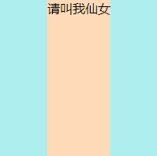

对于行内元素的内容居中，因为行内元素一般都不能设置宽高，而是由内容撑起的，可以设置padding值，所以这里的居中问题考虑的是块级元素内的元素水平居中，而不考虑行内元素内的元素或内容居中
## 1 行内或类行内元素（比如图片、文本、链接等）居中
```html
<style>
    html,body {
        margin: 0;
        padding: 0;
    }
    .wrap{
        width: 200px;
        height: 200px;
        text-align: center;
        background: paleturquoise;
    }
</style>

<div class="wrap">
    <span>请叫我小仙女</span>
</div>
```
块级父容器设置text-align: center;
## 2 块级元素居中
### 2.1 margin
```html
<style>
    html,body {
        margin: 0;
        padding: 0;
    }
    .wrap{
        width: 200px;
        height: 200px;
        background: paleturquoise;
    }
    .in{
        width: 100px;
        margin-left: 50px;
        background: peachpuff;
    }
</style>

<div class="wrap">
    <div class="in">请叫我小仙女</div>
</div>
```
>说明：.in的margin-left值为(.wrap的宽度-.in的宽度)/2

优点：最简单的实现方式，兼容各种浏览器
缺点：可扩展性低，内盒子的宽度必须固定，且每当改变内外盒子的宽度，margin-left的值都要重新计算
### 2.2 margin--auto
```html
<style>
    html,body {
        margin: 0;
        padding: 0;
    }
    .wrap{
        width: 200px;
        height: 200px;
        background: paleturquoise;
    }
    .in{
        /* width: 100px; */
        width: fit-content;
        margin: 0 auto;
        background: peachpuff;
    }
</style>

<div class="wrap">
    <div class="in">请叫我小仙女</div>
</div>
```
优点：最简单、常用的实现方式，兼容各种浏览器，并且当内盒子的宽度不固定时（例如上面width:fit-content（宽度收缩到内容））也同样适用
缺点：此属性只能实现水平居中，不能像定位属性那样可以同时实现水平垂直居中
### 2.3 定位position
```html
<style>
    html,body {
        margin: 0;
        padding: 0;
    }
    .wrap{
        width: 200px;
        height: 200px;
        position: relative;
        background: paleturquoise;
    }
    .in{
        width: 100px;
        position: absolute;
        left: 50%;
        margin-left: -50px;
        background: peachpuff;
    }
</style>

<div class="wrap">
    <div class="in">请叫我小仙女</div>
</div>
```
优点：最常用的实现方式，兼容性好，可以在此基础上以同样方法添加top和margin-top实现水平垂直居中
缺点：内盒子的宽度必须固定
### 2.4 定位position结合transform
#### 2.4.1 absolute--transform
```html
<style>
    html,body {
        margin: 0;
        padding: 0;
    }
    .wrap{
        width: 200px;
        height: 200px;
        position: relative;
        background: paleturquoise;
    }
    .in{
        /* width: 100px; */
        width: fit-content;
        position: absolute;
        left: 50%;
        transform: translateX(-50%);
        background: peachpuff;
    }
</style>

<div class="wrap">
    <div class="in">请叫我小仙女</div>
</div>
```
> 注：transform方法，当计算结果含小数位时，会导致整个元素变模糊，解决方案是父级元素设置transform-style:preserve-3d;
优点：弥补了2.3中的缺点，内盒子宽度可以不固定，当内盒子宽度固定时，translateX()括号中的值为负的内盒子宽的二分之一即可，即相当于2.3中的margin-left，而不论内盒子宽度是否固定，translateX()括号中的值都可以是-50%
缺点：transform是CSS3的新属性，所以兼容性比较差
#### 2.4.2 relative--transform
```html
<style>
    html,body {
        margin: 0;
        padding: 0;
    }
    .wrap{
        width: 200px;
        height: 200px;
        background: paleturquoise;
    }
    .in{
        /* width: 100px; */
        width: fit-content;
        position: relative;
        left: 50%;
        transform: translateX(-50%);
        background: peachpuff;
    }
</style>

<div class="wrap">
    <div class="in">请叫我仙女</div>
</div>
<div class="wrap"></div>
```
>说明：这个方法与2.4.1极相似，不同之处在于，此法外盒子不定位，直接给内盒子采取相对定位relative，但一般不会这样使用，都是采用上面那种方法
> 注：transform方法，当计算结果含小数位时，会导致整个元素变模糊，解决方案是父级元素设置transform-style:preserve-3d;
### 2.5 table-cell/inline-block
#### 2.5.1 table-cell
```html
<style>
    html,body {
        margin: 0;
        padding: 0;
    }
    .wrap{
        width: 200px;
        height: 200px;
        display: table-cell;
        background: paleturquoise;
    }
    .in{
        /* width: 100px; */
        width: fit-content;
        margin: 0 auto;
        background: peachpuff;
    }
</style>

<div class="wrap">
    <div class="in">请叫我小仙女</div>
</div>
```
优点：实现简单，内盒子宽度无须固定
缺点：table-cell会跟浮动、定位等属性相互冲突，并且不能设置margin属性
#### 2.5.2 inline-block 1
```html
<style>
    html,body {
        margin: 0;
        padding: 0;
    }
    .wrap{
        width: 200px;
        height: 200px;
        display: inline-block;
        background: paleturquoise;
    }
    .in{
        /* width: 100px; */
        width: fit-content;
        margin: 0 auto;
        background: peachpuff;
    }
</style>

<div class="wrap">
    <div class="in">请叫我小仙女</div>
</div>
```
#### 2.5.3 inline-block 2
```html
<style>
    html,body {
        margin: 0;
        padding: 0;
    }
    .wrap{
        width: 200px;
        height: 200px;
        text-align: center;
        background: paleturquoise;
    }
    .in{
        /* width: 100px; */
        width: fit-content;
        display: inline-block;
        background: peachpuff;
    }
</style>

<div class="wrap">
    <div class="in">请叫我仙女</div>
</div>
```
>说明：把内盒子设成行内块元素，使用1中行内元素的居中方式

优点：内盒子宽度无须固定
### 2.6 flex
```html
<style>
    html,body {
        margin: 0;
        padding: 0;
    }
    .wrap{
        width: 200px;
        height: 200px;
        display: flex;
        justify-content: center;
        background: paleturquoise;
    }
    .in{
        /* width: 100px; */
        width: fit-content;
        background: peachpuff;
    }
</style>

<div class="wrap">
    <div class="in">请叫我仙女</div>
</div>
```
>说明：justify-content:center;意为flex主轴方向对齐方式：居中。主轴方向flex-direction默认为row即横向
注：如果内盒子不设高度，外盒子使用flex属性后，会出现如下现象因为外盒子没有设置垂直方向上的对齐方式align-items，而它的默认值是stretch即铺满容器，所以就出现了内盒子高度等于外盒子高度，所以未避免这种情况，可以根据需求设置align-items对齐方式，此处可添加align-items:flex-start;即顶端对齐
关于flex可以参考我的博客

优点：实现简单，内盒子宽度无须固定
缺点：flex为CSS3新属性，兼容性差，且flex内的元素float、clear、vertical-align等样式全部失效
### 2.7 增加节点
```html
<style>
    html,body {
        margin: 0;
        padding: 0;
    }
    .wrap{
        width: 200px;
        height: 200px;
        background: paleturquoise;
    }
    .in{
        width: 100px;
        float: left;
        background: peachpuff;
    }
    .hide{
        width: 50px;
        height: 1px;
        float: left;
    }
</style>

<div class="wrap">
    <div class="hide"></div>
    <div class="in">请叫我仙女</div>
</div>
```
>说明：在内盒子前添加一个元素，并且设置宽为内外盒子宽度差的二分之一，高为1px,两个元素都设置float,其实这种方法跟2.1原理是相同的，此处.hide的位置即为2.1中margin-left所占据的位置

优点：请原谅我从宏观上看并没有发现此方法的优点，但不代表这种方法没有用，或许在某些复杂或奇怪的页面结构中，其它方法都不适用，只能采用这种方法呢
缺点：需要增加元素节点，并且用到浮动属性增加页面复杂度，且内盒子宽度固定
## 3 总结
关于水平居中的方法就总结到这里了，如果小伙伴们还有其它方法，或者在具体的实践中遇到任何问题，都欢迎大家在评论区积极讨论，我也会一直关注的哦✌
 


