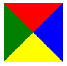
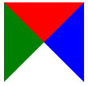
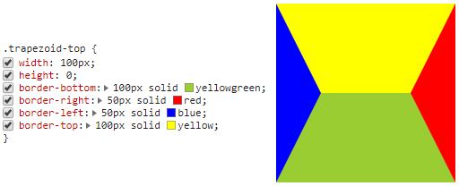
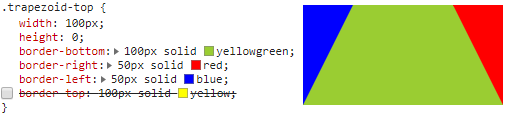
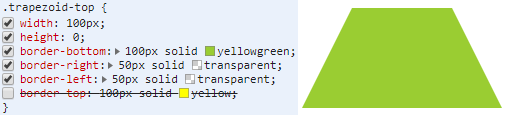
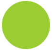
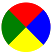
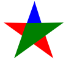
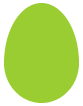
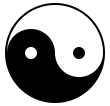

在实际应用中很多地方会用到一些小的形状图标及显示框等各种图形，而这时候如果使用图片不仅不能自适应内容还会在加载页面时增加图片请求从而降低页面性能，此时我们就可以用纯CSS的各种属性来解决这个问题了
## <div id='preface'>CSS之border前言</div>
由于我们下面介绍的方法大多数都要用到border这个样式属性，所以先介绍一下它，如果想对border进一步了解，可以翻看我前面的那篇博客。
最初border是用来给元素加边框的，随着CSS的发展和实际开发的需求，border被用在更多地方，比如用border的属性实现椭圆、梯形、心形等各种图形以及各种对话气泡上，在这里我们先看一下border的四个边属性
<!-- 注：一定要注意border属性中的数值指的是边框宽度，而并非是边框长度，边框长度是由元素的宽高决定的，如果没有宽高则又各个边框的比例决定，切记！切记??? -->
```html
.border{
    width: 0;
    height: 0;
    border-top: 50px solid red;
    border-right: 50px dashed blue;
    border-bottom: 50px solid yellow;
    border-left: 50px solid green;
}
```

注：如果要实现没有下边框，也就是没有上图中的黄色部分，则应该把上面代码中的border-bottom的颜色yellow改为transparent而不是把border-bottom去掉，两种做法的区别见下图，第一个是改为transparent，第二个是直接去掉border-bottom属性

## 矩形
### 正方形
```html
.square{
    width: 0;
    height: 0;
    border: 50px solid yellowgreen;
}
```

### 长方形
```html
.square{
    width: 0;
    height: 0;
    border-top: 50px solid yellowgreen;
    border-right: 100px solid yellowgreen;
    border-bottom: 50px solid yellowgreen;
    border-left: 100px solid yellowgreen;
}
```

## 平行四边形
```html
.parallelogram{
    width: 100px;
    height: 50px;
    -webkit-transform: skew(20deg);/* Safari 和 Chrome */
    -moz-transform: skew(20deg);/* Firefox */
    -o-transform: skew(20deg);/* Opera */
    -ms-transform: skew(20deg);/* IE 9 */
    transform: skew(20deg);
    background: yellowgreen;
}
```

注：transform是CSS3的属性，skew()为倾斜角度，括号中分别为沿X轴和Y轴两个值，用逗号分隔，当只有一个值时默认为沿X轴倾斜，允许负值（反方向），这里我就不贴图了，感兴趣的话可以拿上面那段代码改改试试
## 菱形
```html
.rhomb{
    width: 100px;
    height: 100px;
    -webkit-transform-origin: 0 100%;
    -moz-transform-origin: 0 100%;
    -o-transform-origin: 0 100%;
    -ms-transform-origin: 0 100%;
    transform-origin: 0 100%;
    -webkit-transform: rotate(45deg);
    -moz-transform: rotate(45deg);
    -o-transform: rotate(45deg);
    -ms-transform: rotate(45deg);
    transform: rotate(45deg);
    background: yellowgreen;
}
```

注：transform-origin规定旋转基点，rotate()旋转角度
## 梯形
### 梯形-向上
```html
.trapezoid-top{
    width: 100px;
    height: 0;
    border-bottom: 100px solid yellowgreen;
    border-right: 50px solid transparent;
    border-left: 50px solid transparent;
}
```

如果直接看上面的代码不太明白，可以看下面的图例

这张图其实跟CSS之border前言中的图一样，只是这里的左右边框宽度跟上下边框宽度不一样，当然当这四种颜色相同时就是我们的2.1中长方形的样子了，对比这张图跟最终的效果图有什么不一样？对了，就是我们上面提到过的把borer-top属性去掉，那就成了下面这种样子

然后我们再把左右边框变成透明的就OK了

怎么样，是不是跟上面的效果图一样了。理解了这个，下面的梯形面向各个方向我们就不详细解释原理了
### 梯形-向下
```html
.trapezoid-bottom{
    width: 100px;
    height: 0;
    border-top: 100px solid yellowgreen;
    border-right: 50px solid transparent;
    border-left: 50px solid transparent;
}
```

没错，就是把上面的代码中的bottom改成top即可
### 梯形-向左
```html
.trapezoid-left{
    width: 100px;
    height: 100px;
    border-right: 100px solid yellowgreen;
    border-top: 50px solid transparent;
    border-bottom: 50px solid transparent;
}
```
注：这里的height指定了外边框的长度，所以必须有，否则梯形就变成了三角形

### 梯形-向右
```html
.trapezoid-right{
    width: 100px;
    height: 100px;
    border-left: 100px solid yellowgreen;
    border-top: 50px solid transparent;
    border-bottom: 50px solid transparent;
}
```

### 圆角梯形
```html
.trapezoid-radius{
    width: 100px;
    height: 40px;
    background: yellowgreen;
    border-radius: .5em .5em 0 0;
    -webkit-transform: scaleY(1.3) perspective(.5em) rotateX(5deg);
    -moz-transform: scaleY(1.3) perspective(.5em) rotateX(5deg);
    -ms-transform: scaleY(1.3) perspective(.5em) rotateX(5deg);
    -o-transform: scaleY(1.3) perspective(.5em) rotateX(5deg);
    transform: scaleY(1.3) perspective(.5em) rotateX(5deg);/*scaleY: 纵轴放大1.3倍，使梯形高度等于height；perspective:3d透视效果，元素距离视图的距离*/
    -webkit-transform-origin: bottom;
    -moz-transform-origin: bottom;
    -ms-transform-origin: bottom;
    -o-transform-origin: bottom;
    transform-origin: bottom;/*以底轴为基轴*/
}
```
圆角梯形的实现原理跟其它的是不同的，圆角梯形是先实现圆角矩形，然后给矩形做3D变换，让它以底边框为基轴，向Z轴方向倾斜，视觉上就形成了圆角梯形

## <div id='triangle'>三角形<div>
### 三角形-向上
```html
.triangle-top {
    width: 0;
    height: 0;
    border: 50px solid yellowgreen;
    border-color: transparent transparent yellowgreen;
}
```

这里border-color有三个值，第一个代表上边框颜色，第二个代表左右边框颜色，第三个代表下边框颜色，关于这些在我上一篇博客中有详细的描述，感兴趣的话可以看看。其实还有别的写法，比如下面这样
```html
.triangle-top {
    width: 0;
    height: 0;
    border: 50px solid transparent;
    border-bottom: 50px solid yellowgreen;
}
```
这种写法可以实现等腰三角形而非等边三角形
### 三角形-向下
```html
.triangle-bottom {
    width: 0;
    height: 0;
    border: 50px solid yellowgreen;
    border-color: yellowgreen transparent transparent;
}
```

### 三角形-向左
```html
.triangle-left {
    width: 0;
    height: 0;
    border: 50px solid yellowgreen;
    border-color: transparent yellowgreen transparent transparent;
}
```

### 三角形-向右
```html
.triangle-right {
    width: 0;
    height: 0;
    border: 50px solid yellowgreen;
    border-color: transparent transparent transparent yellowgreen;
}
```

### 三角形-左上
```html
.triangle-ltop {
    width: 0;
    height: 0;
    border-top: 100px solid yellowgreen;
    border-right: 100px solid transparent;
}
```

### 三角形-右上
```html
.triangle-rtop {
    width: 0;
    height: 0;
    border-right: 100px solid yellowgreen;
    border-bottom: 100px solid transparent;
}
```

### 三角形-左下
```html
.triangle-lbottom {
    width: 0;
    height: 0;
    border-left: 100px solid yellowgreen;
    border-top: 100px solid transparent;
}
```

### 三角形-右下
```html
.triangle-rbottom {
    width: 0;
    height: 0;
    border-bottom: 100px solid yellowgreen;
    border-left: 100px solid transparent;
}
```

### 三角形-上下-对角
```html
.triangle-tbottom-diagonal {
    width: 0;
    height: 0;
    border-top: 50px solid yellowgreen;
    border-left: 50px solid transparent;
    border-right: 50px solid transparent;
    border-bottom: 50px solid yellowgreen;
}
```

其实是向上的三角和向下的三角的总和，不信可以把border-top和border-bottom的颜色改成不一样的就会发现了
### <div id='triangle_tb-cover'>三角形-上下-覆盖</div>
```html
.triangle-tbottom-cover {
    width: 0;
    height: 0;
    border-left: 50px solid transparent;
    border-right: 50px solid transparent;
    border-bottom: 100px solid yellowgreen;
    position: relative;
}

.triangle-tbottom-cover:after {
    content: " ";
    width: 0;
    height: 0;
    border-left: 50px solid transparent;
    border-right: 50px solid transparent;
    border-top: 100px solid yellowgreen;
    position: absolute;
    top: 50px;
    left: -50px;
}
```

其实是原理跟上一个一样，上下三角形要覆盖所以用到了定位而且把上下三角形分给了当前元素和当前元素的伪元素:after
调整`.triangle-tbottom-cover:after`的`top`值即可得到六角形


### 三角形-上下-时间沙漏
```html
.triangle-tbottom-time {
    width: 0;
    height: 0;
    border-left: 50px solid transparent;
    border-right: 50px solid transparent;
    border-bottom: 60px solid yellowgreen;
    position: relative;
    margin-top: 50px
}

.triangle-tbottom-time:after {
    content: " ";
    width: 0;
    height: 0;
    border-left: 50px solid transparent;
    border-right: 50px solid transparent;
    border-top: 60px solid yellowgreen;
    position: absolute;
    top: -40px;
    left: -50px;
}
```

跟上一个类似，只是定位的距离做了一些改变
## 圆
```html
.semicircle {
    width: 100px;
    height: 100px;
    background: yellowgreen;
    -webkit-border-radius: 50%;
    -moz-border-radius: 50%;
    border-radius: 50%;
}
```

注：宽高要相等，否则就是椭圆了
### 同心圆
```html
.circle-circle {
    width: 100px;
    height: 100px;
    border: 20px solid #669;
    background: #fff;
    -moz-border-radius: 100px;
    -webkit-border-radius: 100px;
    border-radius: 100px;
}
```

### 椭圆-水平
```html
.oval-horizontal {
    width: 100px;
    height: 50px;
    background: yellowgreen;
    -webkit-border-radius: 50px/25px;
    -moz-border-radius: 50px/25px;
    border-radius: 50px/25px;
}
```
注：水平椭圆即宽度>高度；在本例中border-radius的取值，第一个值为宽度的一半即半长轴，第二个值为高度的一半即半短轴，但也可以直接写成`border-radius:50%`即宽高都各取一半

### 椭圆-垂直
```html
.oval-vertical {
    width: 50px;
    height: 100px;
    background: yellowgreen;
    -webkit-border-radius: 25px/50px
    -moz-border-radius: 25px/50px;
    border-radius: 25px/50px;
}
```
注：水平椭圆即宽度<高度；在本例中border-radius的取值，第一个值为宽度的一半即半短轴，第二个值为高度的一半即半长轴，但也可以直接写成`border-radius:50%`即宽高都各取一半

### 表图
```html
.chartColorful {
    width: 0;
    height: 0;
    border-top: 50px solid red;
    border-right: 50px solid blue;
    border-bottom: 50px solid yellow;
    border-left: 50px solid green;-moz-border-radius: 50px; -webkit-border-radius:50px;
    border-radius: 50%;
}
```
其实这种写法跟1中[CSS之border前言](#preface)一样，只是在那个基础上增加了圆角弧度border-radius而已

### 半圆-上半圆
```html
.semicircle-top {
    width: 100px;/*直径*/
    height: 50px;/*半径*/
    background: yellowgreen;
    -webkit-border-radius: 100px 100px 0 0;
    -moz-border-radius: 100px 100px 0 0;
    border-radius: 100px 100px 0 0;/*半圆弧度为直径*/
}
```

`border-radius`中取值的顺序为左上角 右上角 右下角 左下角，具体请看我的博客[CSS之border详解](../CSS_border)
### 半圆-下半圆
```html
.semicircle-bottom {
    width: 100px;/*直径*/
    height: 50px;/*半径*/
    background: yellowgreen;
    -webkit-border-radius: 0 0 100px 100px;
    -moz-border-radius: 0 0 100px 100px;
    border-radius: 0 0 100px 100px;/*半圆弧度为直径*/
}
```

### 半圆-左半圆
```html
.semicircle-left {
    width: 50px;/*半径*/
    height: 100px;/*直径*/
    background: yellowgreen;
    -webkit-border-radius: 100px 0 0 100px;
    -moz-border-radius: 100px 0 0 100px;
    border-radius: 100px 0 0 100px;/*半圆弧度为直径*/
}
```

### 半圆-右半圆
```html
.semicircle-right {
    width: 50px;/*半径*/
    height: 100px;/*直径*/
    background: yellowgreen;
    -webkit-border-radius: 0 100px 100px 0;
    -moz-border-radius: 0 100px 100px 0;
    border-radius: 0 100px 100px 0;/*半圆弧度为直径*/
}
```

### 四分之一圆-上、下、左、右
```html
.quarterCircle {
    width: 0;
    height: 0;
    border-top: 50px solid yellowgreen;
    border-right: 50px solid transparent;
    border-left: 50px solid transparent;
    -moz-border-radius: 50px; -webkit-border-radius:50px;
    border-radius: 50%;
}
```

跟前面[三角形](#triangle)对应的实现方法一样，只是在三角形的基础上加上`border-radius：50%`即可，所以这里就不再重复写了，如果需要可以在评论去留言
### 四分之一圆-左上
```html
.quarterCircle-ltop {
    width: 50px;
    height: 50px;
    background: yellowgreen;
    -moz-border-radius: 100% 0 0 0;
    -webkit-border-radius: 100% 0 0 0;
    border-radius: 100% 0 0 0;
}
```

注：因为这里画的是四分之一圆，所以宽高即为半径，而border-radius的取值等于半径时即可成圆的弧度，所以这里border-radius取值为100%，当然也可以不用百分比表示，而用像素值50px，原理是一样的
当border-radius取值为50%时是如下形状

### 四分之一圆-右上
```html
.quarterCircle-rtop {
    width: 50px;
    height: 50px;
    background: yellowgreen;
    -moz-border-radius: 100% 0 0 0;
    -webkit-border-radius: 100% 0 0 0;
    border-radius:0 100% 0 0;
}
```

### 四分之一圆-右下
```html
.quarterCircle-rbottom {
    width: 50px;
    height: 50px;
    background: yellowgreen;
    -moz-border-radius: 100% 0 0 0;
    -webkit-border-radius: 100% 0 0 0;
    border-radius:0 0 100% 0;
}
```


### 四分之一圆-左下
```html
.quarterCircle-lbottom {
    width: 50px;
    height: 50px;
    background: yellowgreen;
    -moz-border-radius: 100% 0 0 0;
    -webkit-border-radius: 100% 0 0 0;
    border-radius:0 0 0 100%;
}
```

### 四分之三圆-上开口
```html
.chart-top {
    width: 0;
    height: 0;
    border: 50px solid yellowgreen;
    border-top-color: transparent;
    -moz-border-radius:50%;
    -webkit-border-radius:50%;
    border-radius:50%;
}
```

### 四分之三圆-下开口
```html
.chart-bottom {
    width: 0;
    height: 0;
    border: 50px solid yellowgreen;
    border-bottom-color: transparent;
    -moz-border-radius:50%;
    -webkit-border-radius:50%;
    border-radius:50%;
}
```

### 四分之三圆-左开口
```html
.chart-left {
    width: 0;
    height: 0;
    border: 50px solid yellowgreen;
    border-left-color: transparent;
    -moz-border-radius:50%;
    -webkit-border-radius:50%;
    border-radius:50%;
}
```

### 四分之三圆-右开口
```html
.chart-right {
    width: 0;
    height: 0;
    border: 50px solid yellowgreen;
    border-right-color: transparent;
    -moz-border-radius:50%;
    -webkit-border-radius:50%;
    border-radius:50%;
}
```

## 书签
```html
.bookmark{
    width: 0;
    height: 0;
    border-top: 50px solid yellowgreen;
    border-left: 30px solid yellowgreen;
    border-right: 30px solid yellowgreen;
    border-bottom: 30px solid transparent;
}
```

有两种方法，这种写法书签的高度是由border-top的宽度50px与border-bottom的宽度30px相加得到的,其实跟[CSS之border前言](#preface)中的第二张图原理是一样的
```html
.bookmark2{
    width: 0; 
    height: 100px; 
    border-left: 50px solid green; 
    border-right: 50px solid yellowgreen; 
    border-bottom: 35px solid transparent;
}
```

这种方法书签的高度是由height确定的，为了便于理解，这里把左右边框颜色做了区分
## 胶囊
```html
.capsule {
    width: 100px;
    height: 44px;
    background: yellowgreen;
    -moz-border-radius: 22px;
    -webkit-border-radius: 22px;
    border-radius: 22px;
}
```

这种方法书签的高度是由height确定的，为了便于理解，这里把左右边框颜色做了区分
注：border-radius的取值为高度的一半即可（胶囊其实就是两侧为半圆形，中间为矩形的图形，为实现两侧的半圆形让border-radius的值为高度的一半即半径即可），当宽高交换时即为垂直方向上的胶囊，此处不再列举
### 半胶囊
```html
.capsule-top {
    width: 40px;
    height: 60px;
    background: yellowgreen;
    -moz-border-radius: 22px 22px 0 0;
    -webkit-border-radius: 22px 22px 0 0;
    border-radius: 22px 22px 0 0;
}
```

### 倾斜半胶囊
```html
.capsule-top-r45 {
    width: 40px;
    height: 60px;
    background: yellowgreen;
    -moz-border-radius: 22px 22px 0 0;
    -webkit-border-radius: 22px 22px 0 0;
    border-radius: 22px 22px 0 0;
    -moz-transform: rotate(-45deg);
    -ms-transform: rotate(-45deg);
    -o-transform: rotate(-45deg);
    -webkit-transform: rotate(-45deg);
    transform: rotate(-45deg);
}
```

其实就是让半胶囊旋转倾斜一定角度
## 心形
心形其实是由半胶囊组成的
```html
.heart {
    position: relative;
}
.heart:before,
.heart:after {
    width: 40px;
    height: 60px;
    position: absolute;
    content: "";
    left: 50px;
    top: 0;
    background: yellowgreen;
    -moz-border-radius: 50px 50px 0 0;
    border-radius: 50px 50px 0 0;
    -webkit-transform: rotate(-45deg);
    -moz-transform: rotate(-45deg);
    -ms-transform: rotate(-45deg);
    -o-transform: rotate(-45deg);
    transform: rotate(-45deg);
    -webkit-transform-origin: 0 100%;
    -moz-transform-origin: 0 100%;
    -ms-transform-origin: 0 100%;
    -o-transform-origin: 0 100%;
    transform-origin: 0 100%;
}
.heart:after {
    left: 10px;
    -webkit-transform: rotate(45deg);
    -moz-transform: rotate(45deg);
    -ms-transform: rotate(45deg);
    -o-transform: rotate(45deg);
    transform: rotate(45deg);
    -webkit-transform-origin: 100% 100%;
    -moz-transform-origin: 100% 100%;
    -ms-transform-origin: 100% 100%;
    -o-transform-origin: 100% 100%;
    transform-origin: 100% 100%;
}
```
注：`transform-origin`设置旋转元素的基点，第一个值为X轴方向向右，第二个值为Y轴方向向下，所以`0 100%`为以左下角为基点旋转，`100% 100%`为以右下角为基点旋转

当然也可以这么写
```html
.heart{
    position: relative;
    -moz-transform: rotate(-45deg);
    -ms-transform: rotate(-45deg);
    -o-transform: rotate(-45deg);
    -webkit-transform: rotate(-45deg);
    transform: rotate(-45deg);
}
.heart::after{
    content: '';            
    -moz-transform: rotate(45deg);
    -ms-transform: rotate(45deg);
    -o-transform: rotate(45deg);
    -webkit-transform: rotate(45deg);
    transform: rotate(90deg);
    position: absolute;
    top: 10px;
    left: 10px;
}
.heart,.heart::after {
    width: 40px;
    height: 60px;
    background: yellowgreen;
    -moz-border-radius: 20px 20px 0 0;
    -webkit-border-radius: 20px 20px 0 0;
    border-radius: 20px 20px 0 0;
}
```
### 旋转心形
```html
.heart {
    position: relative;
    width: 80px;
    height: 80px;
    -webkit-transform: rotate(-45deg);
    -moz-transform: rotate(-45deg);
    -ms-transform: rotate(-45deg);
    -o-transform: rotate(-45deg);
    transform: rotate(-45deg);
    -webkit-transform-origin: 50% 100%;
    -moz-transform-origin: 50% 100%;
    -ms-transform-origin: 50% 100%;
    -o-transform-origin: 50% 100%;
    transform-origin: 50% 100%;
    margin: 100px;
}
.heart:before,
.heart:after {
    width: 40px;
    height: 60px;
    position: absolute;
    content: "";
    left: 50px;
    top: 0;
    background: yellowgreen;
    -moz-border-radius: 50px 50px 0 0;
    border-radius: 50px 50px 0 0;
    -webkit-transform: rotate(-45deg);
    -moz-transform: rotate(-45deg);
    -ms-transform: rotate(-45deg);
    -o-transform: rotate(-45deg);
    transform: rotate(-45deg);
    -webkit-transform-origin: 0 100%;
    -moz-transform-origin: 0 100%;
    -ms-transform-origin: 0 100%;
    -o-transform-origin: 0 100%;
    transform-origin: 0 100%;
}
.heart:after {
    left: 10px;
    -webkit-transform: rotate(45deg);
    -moz-transform: rotate(45deg);
    -ms-transform: rotate(45deg);
    -o-transform: rotate(45deg);
    transform: rotate(45deg);
    -webkit-transform-origin: 100% 100%;
    -moz-transform-origin: 100% 100%;
    -ms-transform-origin: 100% 100%;
    -o-transform-origin: 100% 100%;
    transform-origin: 100% 100%;
}
```
其实就是在心形的基础上，让元素旋转一定的角度，即修改`transform: rotate()`中的值，注旋转时要设置旋转的基点，设置旋转基点前要给元素规定宽高，否则会以整个文档中心为基点进行旋转
或者第二种画心形的方法中，直接修改`.heart`的`transform: rotate()`值即可

这里我就列举了一个例子，想要什么角度的心形，自行修改旋转角度即可得到，就不再一一列举出来了
## 多角形
### 五角星
```html
.star-five {
    width: 0px;
    height: 0px;
    display: block;
    position: relative;
    color: #000;
    border-right: 100px solid transparent;
    border-bottom: 70px solid yellowgreen;
    border-left: 100px solid transparent;
    -moz-transform: rotate(36deg);
    -webkit-transform: rotate(36deg);
    -ms-transform: rotate(36deg);
    -o-transform: rotate(36deg);
    transform: rotate(36deg);
}
.star-five:before {
    content: '';
    width: 0;
    height: 0;
    display: block;
    position: absolute;
    top: -55px;
    left: -65px;
    border-bottom: 90px solid yellowgreen;
    border-left: 30px solid transparent;
    border-right: 30px solid transparent;
    -webkit-transform: rotate(-35deg);
    -moz-transform: rotate(-35deg);
    -ms-transform: rotate(-35deg);
    -o-transform: rotate(-35deg);
    transform: rotate(-35deg);
}
.star-five:after {
    content: '';
    width: 0px;
    height: 0px;
    display: block;
    position: absolute;
    top: 3px;
    left: -106px;
    border-right: 100px solid transparent;
    border-bottom: 70px solid yellowgreen;
    border-left: 100px solid transparent;
    -webkit-transform: rotate(-72deg);
    -moz-transform: rotate(-72deg);
    -ms-transform: rotate(-72deg);
    -o-transform: rotate(-72deg);
    transform: rotate(-72deg);
}
```

其实就是两个等腰钝角三角形和一个等腰锐角三角形组合而成，这两个等腰钝角三角形都是由向上三角形（即只显示下边框）旋转各自的度数组成，然后再加上一个向上三角形就成了五角星，把这三个形状分为不同颜色，如下图就可以看出

红色和绿色为两个钝角等腰三角形，蓝色的是一个锐角等腰三角形
### 六角星
关于六角星，我们在[六角星-上下-覆盖](#triangle_tb-cover)中已经提到过了，就是调整`.triangle-tbottom-cover:after`的`top`值即可得到六角星
```html
.star-six {
    width: 0;
    height: 0;
    border-left: 50px solid transparent;
    border-right: 50px solid transparent;
    border-bottom: 100px solid yellowgreen;
    position: relative;
}
.star-six:after {
    content: " ";
    width: 0;
    height: 0;
    border-left: 50px solid transparent;
    border-right: 50px solid transparent;
    border-top: 100px solid yellowgreen;
    position: absolute;
    top: 33px;
    left: -50px;
}
```

### 八角星
```html
.star-eight {
    width: 80px;
    height: 80px;
    background: yellowgreen;
    position: relative;
    -webkit-transform: rotate(20deg);
    -moz-transform: rotate(20deg);
    -ms-transform: rotate(20deg);
    -o-transform: rotate(20eg);
    transform: rotate(20deg);
}
.star-eight:before {
    content: "";
    width: 80px;
    height: 80px;
    background: yellowgreen;
    position: absolute;
    top: 0;
    left: 0;
    -webkit-transform: rotate(135deg);
    -moz-transform: rotate(135deg);
    -ms-transform: rotate(135deg);
    -o-transform: rotate(135deg);
    transform: rotate(135deg);
}
```

即两个正方形旋转一定，角度然后叠加在一起
### 十二角星
```html
.star-twelve{
            width: 80px;
            height: 80px;
            background: yellowgreen;
            position: relative;
        }
        .star-twelve:before,
        .star-twelve:after{
            content: "";
            width: 80px;
            height: 80px;
            background: yellowgreen;
            position: absolute;
            top: 0;
            left: 0;
        }
        .star-twelve:after {
            -webkit-transform: rotate(20deg);
            -moz-transform: rotate(20deg);
            -ms-transform: rotate(20deg);
            -o-transform: rotate(20eg);
            transform: rotate(30deg);
        }
        .star-twelve:before {
            -webkit-transform: rotate(135deg);
            -moz-transform: rotate(135deg);
            -ms-transform: rotate(135deg);
            -o-transform: rotate(135deg);
            transform: rotate(60deg);
        }
```

很明显就是有3个正方形旋转一定角度，然后叠加而成的，后面的就以此类推了，都是由基础图形旋转叠加所得
## 多边形
### 五边形
```html
.pentagon {
    position: relative;
    width: 54px;
    border-top: 50px solid yellowgreen;
    border-right: 18px solid transparent;
    border-left: 18px solid transparent;
}
.pentagon:before {
    content: "";
    width: 0;
    height: 0;
    position: absolute;
    top: -85px;
    left: -18px;
    border-right: 45px solid transparent;
    border-left: 45px solid transparent;
    border-bottom: 35px solid yellowgreen;
}
```

### 六边形
```html
.hexagon {
    width: 100px;
    height: 55px;
    background: yellowgreen;
    position: relative;
}
.hexagon:before {
    content: "";
    width: 0;
    height: 0;
    position: absolute;
    top: -25px;
    left: 0;
    border-left: 50px solid transparent;
    border-right: 50px solid transparent;
    border-bottom: 25px solid yellowgreen;
}
.hexagon:after {
    content: "";
    width: 0;
    height: 0;
    position: absolute;
    bottom: -25px;
    left: 0;
    border-top: 25px solid yellowgreen;
    border-left: 50px solid transparent;
    border-right: 50px solid transparent;
}
```

上面这个例子是由两个三角形和一个矩形组成的，下面这个例子是由两个梯形组成的，它们得到的效果是相同的，都是上面这个图
```html
.hexagon {
    width: 0;
    height: 50px;
    border-top: 25px solid transparent;
    border-right: 50px solid yellowgreen;
    border-bottom: 25px solid transparent;
    position: relative;
}
.hexagon:before {
    content: "";
    width: 0;
    height: 50px;
    position: absolute;
    top: -25px;
    left: 50px;
    border-top: 25px solid transparent;
    border-left: 50px solid yellowgreen;
    border-bottom: 25px solid transparent;
}
```
有趣的是调整`.hexagon:before`的`top`和`left`会得到不同的效果，例如当设置`top`和`left`均为0时会组成平行四边形

当设置`top:-25px;left:0;`时，会组成下面的图形

### 八边形
```html
.octagon {
    width: 100px;
    height: 37px;
    background: yellowgreen;
    position: relative;
}
.octagon:before {
    content: "";
    width: 42px;
    height: 0;
    position: absolute;
    top: -31px;
    left: 0;
    border-bottom: 31px solid yellowgreen;
    border-left: 29px solid transparent;
    border-right: 29px solid transparent;
}
.octagon:after {
    content: "";
    width: 42px;
    height: 0;
    position: absolute;
    top: 37px;
    left: 0;
    border-top: 31px solid yellowgreen;
    border-left: 29px solid transparent;
    border-right: 29px solid transparent;
}
```

由两个梯形和一个矩形组成，一次类推，其实多边形的实现都是由简单的三角形、矩形、梯形旋转堆叠而成的
## 鸡蛋
```html
.egg {
    width: 75px;
    height: 100px;
    display: block;
    background-color: yellowgreen;
    -webkit-border-radius: 38px 38px 38px 38px / 60px 60px 40px 40px;
    border-radius: 50% 50% 50% 50% / 60% 60% 40% 40%;
}
```
注：`border-radius`中前四个值是四个角在`width`的基础上的圆角度值，`/`之后的四个值是四个角在`height`的基础上的圆角度值

## 钻石
```html
.diamond {
    width: 50px;
    height: 0;
    border-right: 25px solid transparent;
    border-left: 25px solid transparent;
    border-bottom: 25px solid yellowgreen;
    position: relative;
}
.diamond:after {
    content: "";
    width: 0;
    height: 0;
    position: absolute;
    top: 25px;
    left: -25px;
    border-top: 70px solid yellowgreen;
    border-right: 50px solid transparent;
    border-left: 50px solid transparent;
}
```

很简单，跟多边形的原理一样，就是由一个梯形和一个三角形组成
## 八卦
```html
.gossip {
    width: 96px;
    height: 48px;
    background: white;
    border-color: black;
    border-style: solid;
    border-width: 2px 2px 50px 2px;
    border-radius: 50%;
    position: relative;
}
.gossip:before {
    content: "";
    width: 12px;
    height: 12px;
    position: absolute;
    top: 50%;
    left: 0;
    background: white;
    border: 18px solid black;
    border-radius: 50%;
}
.gossip:after {
    content: "";
    position: absolute;
    top: 50%;
    left: 50%;
    background: black;
    border: 18px solid white;
    border-radius: 50%;
    width: 12px;
    height: 12px;
}
```

从下面这张图可以看出，其实这个八卦图是由一个底边框为50%，其它边框为2px的圆和两个宽高均为12px且都18px边框包围的圆组成

总结：通过这么多图形，我们不难发现，其实很多看起来很复杂的形状都是由最初的简单的形状通过旋转组合而成的，在实现这些图形的过程中，我也有很多发现，很多时候不经意间的调整某个值，会发生意想不到的效果。这里仅仅列举了一部分，我相信肯定还有更多好玩的有趣的图形等待我们发现，你还有哪些图形，可以在评论区留言，大家一起讨论学习一下
最后，本篇文章是由二蛋的前端博客：http://yyeggs.com//CSS_border_graph/ 整理的，其中有很多都是我在整理的时候意外发现的，也有很多我自己的理解和解释，所以转载请注明，另外这里的部分代码整理于http://www.itivy.com/ivy/archive/2012/1/16/css-shape.html 也请同样注明