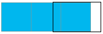
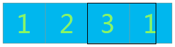
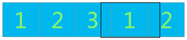

很早之前就想整理一篇关于轮播图的博客了，可一直也没有时间，放着放着就忘了，昨天看到一个比较有意思的轮播图，一下子又勾起了我的兴趣，今天就开始着手整理轮播图的几种实现方法，几乎可以涵盖目前网页中大部分轮播图形式，今天先整理一篇稍微简单点的--平滑无缝滚动轮播图
## 核心思想及问题
平滑无缝滚动轮播图的核心思想很简单，就是外盒子给定宽度（大约是一到两张图片的宽度）而内盒子（这里用ul标签）宽度则是所有图片宽度的总和,并且ul相对于外盒子绝对定位，所有图片左浮动，排成一行，改变ul的left值使其向左滑动即可。
但这里有个很关键的问题就是，当最后一张图片完全进入可视区域后，整个轮播图就像下面这样

而此时要继续滚动，则会造成下面这样的效果

可视区域的右侧出现了空白，而我们是想让这空白部分显示第一张图，也就是说我们想让可是区域同时显示最后一张图和第一张图的一部分，但是所有的图片都在ul中，而ul中的图片是横向排列的，那我们该怎么办呢？
很简单，我们复制第一张图片到最后就可以解决。

同样道理，当复制的第一张图片完全进入可视区域后，此时最后一张图片还没有完全滑出可视区域范围，无法让ul的left=0，所以我们还得复制第二张图片放到最后（也就是复制的第一张图片的后面）

当第三张图片滑出可视区域范围时，设置ul的left为0,则轮播图的循环从头开始。
## 完整代码
[效果预览](http://htmlpreview.github.io/?https://github.com/eggs116/eggs116.github.io/blob/hexo/source/demo/slideshow/slideshow_marquee.html)
CSS
```css
html,
body {
    margin: 0;
    padding: 0;
}
ul,
ol {
    list-style: none;
    margin: 0;
    padding: 0;
}
.wrap {
    width: 600px;
    height: 260px;
    padding: 5px;
    border: 1px solid #ccc;
    margin: 100px auto;
    position: relative;
}
.slide {
    width: 600px;
    height: 260px;
    position: relative;
    overflow: hidden;
}
ul {
    width: 3600px;
    position: absolute;
    left: 0;
}
ul li {
    float: left;
}
img {
    width: 400px;
    height: 260px;
    vertical-align: middle;
}
```
HTML
```html
<div class="wrap" id="wrap">
    <div class="slide" id="slide">
        <ul>
            <li></li>
            <li></li>
            <li></li>
            <li></li>
            <li></li>
            <li></li>
            <li></li>
        </ul>
    </div>
</div>
```
JS
```javascript
var wrap = document.getElementById('wrap');
var ul = wrap.getElementsByTagName('ul')[0];
var lis = ul.children;
var w_lefter=lis[0].offsetWidth;
var lis_len = lis.length;//7
var lefter = 0; //ul的left值
ul.append(lis[0].cloneNode(true), lis[1].cloneNode(true)); //复制第1/2张图片并追加到最后,此时lis.length为9,而lis_len仍为7
ul.timer = setInterval(nextAnimate, 6);
function nextAnimate() { //动画函数
    lefter--;
    lefter < -lis_len*w_lefter ?lefter = 0 : lefter;
    ul.style.left = lefter + "px";
}
wrap.addEventListener('mouseover', function () {
    clearInterval(ul.timer);
})
wrap.addEventListener('mouseout', function () {
    ul.timer = setInterval(nextAnimate, 6);
})
```


总结：这种形式的轮播图只要搞懂了核心思想，其实很简单，也是比较常用的，而后面我也将介绍其他几种稍微复杂点的轮播图，感兴趣的话可以关注一下。
本篇文章是由二蛋的前端博客：http://yyeggs.com/slideshow_marquee/ 整理，转载请注明