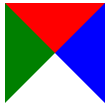

很早之前就想整理一篇关于轮播图的博客了，可一直也没有时间，放着放着就忘了，昨天看到一个比较有意思的轮播图，一下子又勾起了我的兴趣，今天就开始着手整理轮播图的几种实现方法，几乎可以涵盖目前网页中大部分轮播图形式，今天先整理一篇稍微简单点的--平滑无缝滚动轮播图
## 
平滑无缝滚动轮播图的核心思想很简单，就是外盒子给定宽度（大约是一到两张图片的宽度）而内盒子（这里用ul标签）宽度则是所有图片宽度的总和,并且ul相对于外盒子绝对定位，所有图片左浮动，排成一行，改变ul的left值使其向左滑动即可。
但这里有个很关键的问题就是，当最后一张图片完全进入可视区域后，整个轮播图就像下面这样

而此时要继续滚动，则会造成下面这样的效果


<!-- 注：一定要注意border属性中的数值指的是边框宽度，而并非是边框长度，边框长度是由元素的宽高决定的，如果没有宽高则又各个边框的比例决定，切记！切记??? -->
```html
.border{
    width: 0;
    height: 0;
    border-top: 50px solid red;
    border-right: 50px dashed blue;
    border-bottom: 50px solid yellow;
    border-left: 50px solid green;
}
```

注：如果要实现没有下边框，也就是没有上图中的黄色部分，则应该把上面代码中的border-bottom的颜色yellow改为transparent而不是把border-bottom去掉，两种做法的区别见下图，第一个是改为transparent，第二个是直接去掉border-bottom属性

## 矩形
### 正方形
```html
.square{
    width: 0;
    height: 0;
    border: 50px solid yellowgreen;
}
```


总结：通过这么多图形，我们不难发现，其实很多看起来很复杂的形状都是由最初的简单的形状通过旋转组合而成的，在实现这些图形的过程中，我也有很多发现，很多时候不经意间的调整某个值，会发生意想不到的效果。这里仅仅列举了一部分，我相信肯定还有更多好玩的有趣的图形等待我们发现，你还有哪些图形，可以在评论区留言，大家一起讨论学习一下
最后，本篇文章是由二蛋的前端博客：http://yyeggs.com//CSS_border_graph/ 整理的，其中有很多都是我在整理的时候意外发现的，也有很多我自己的理解和解释，所以转载请注明，另外这里的部分代码整理于http://www.itivy.com/ivy/archive/2012/1/16/css-shape.html 也请同样注明